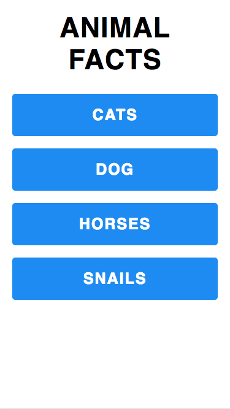

# Front-end Development Assessment - Animal Facts

## Instructions
1. Fork this repo as a public repo.
    - 
    - 
    - 
1. Pull your repo locally.
1. Branch into a feature branch.
1. Develop according to the Acceptance Criteria below on the feature branch. Time limit is 1 hour.
1. Design specs are in [design-specs/](design-specs/).
1. Start based off the code in [code/index.html](code/index.html).
1. You probably will want to use a local web server to develop with. The [Chrome Web Server](https://chrome.google.com/webstore/detail/web-server-for-chrome/ofhbbkphhbklhfoeikjpcbhemlocgigb?hl=en) is an easy Chrome server extension to use. Point the root to [code/](code/).
1. For writing JS, please use a separate JS file.
1. When writing JS, please use vanilla JS and no frameworks.
1. For writing CSS, please use a separate CSS file.
1. Googling is allowed.
1. The [code/api/facts/](code/api/facts/) path contains a mock facts data JSON API. Endpoints to get data are `api/facts/cat.json`, `api/facts/dog.json`, etc.
1. When managing your time, please focus first on the JS functionality, then on the CSS and HTML.
1. When ready to submit, push the feature branch to your public repo.
1. Open a PR from the feature branch to the main branch.
    - 
    - 
    - 
1. Share the link to your public repo with us.

## Acceptance Criteria
- Create one experience which is responsive for desktop and mobile based off of the specs in `design-specs/`.
    - 
    - 
- Assume mobile devices are 600px and smaller.
- When clicking the animal buttons a popup should open with the right animal's facts data. Data within this should be requested through the mock facts API, `/api/facts/...`.
- When clicking the close button in the popup, the popup should close.
- If popup content is longer than can be displayed on the screen, it should be scrollable, as seen in the specs.
- Functionality should work in IE9 and above.